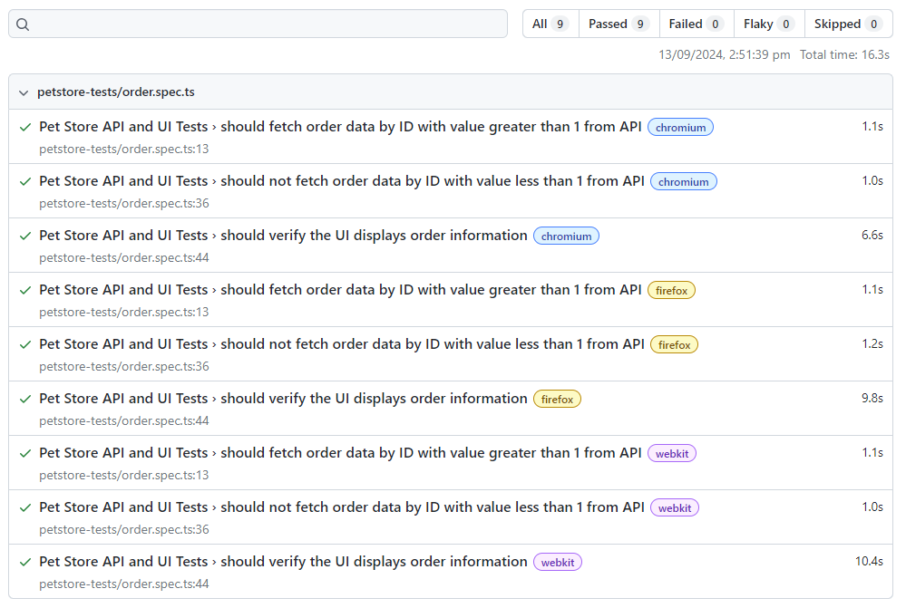

# playwright-github-action
- Integrate Playwright tests with GitHub Actions workflows to easily run API and end-to-end tests across multiple browsers and platforms.
- [Page Object Model (POM)](https://playwright.dev/docs/pom) is used in automation testing project to help reduce code duplication and improves test code maintenance.
- Several useful commands to run locally:
  1) Runs the end-to-end tests: `npx playwright test`
  2) Starts the interactive UI mode: `npx playwright test --ui`
  3) Runs the tests only on Desktop Chrome: `npx playwright test --project=chromium`
  4) Runs the tests in a specific file: `npx playwright test example`
  5) Runs the tests in debug mode: `npx playwright test --debug`
  6) Auto generate tests with Codegen: `npx playwright codegen`
 
- On the [workflow details page](https://github.com/EmeraldCHEN/playwright-github-action/actions/workflows/playwright.yml?query=branch%3Amain+event%3Aworkflow_dispatch+actor%3AEmeraldCHEN), click the “Run workflow” button in the dialog box to start the workflow manually

📗 Here's <a href="https://github.com/EmeraldCHEN/playwright-github-action/blob/main/tests/saucedemo-tests" target="_blank">saucedemo-tests</a>, which tests login, checkout, etc.

```
npx playwright test tests/saucedemo-tests
```
  


📗 Here's <a href="https://github.com/EmeraldCHEN/playwright-github-action/blob/main/tests/petstore-tests/order.spec.ts" target="_blank">petstore-tests/order.spec.ts</a>, which tests the integration of the API and UI on the page: [Find purchase order by ID](https://petstore.swagger.io/#/store/getOrderById)

```
npx playwright test tests/petstore-tests/order.spec.ts
```

 


Happy testing! 🚀
